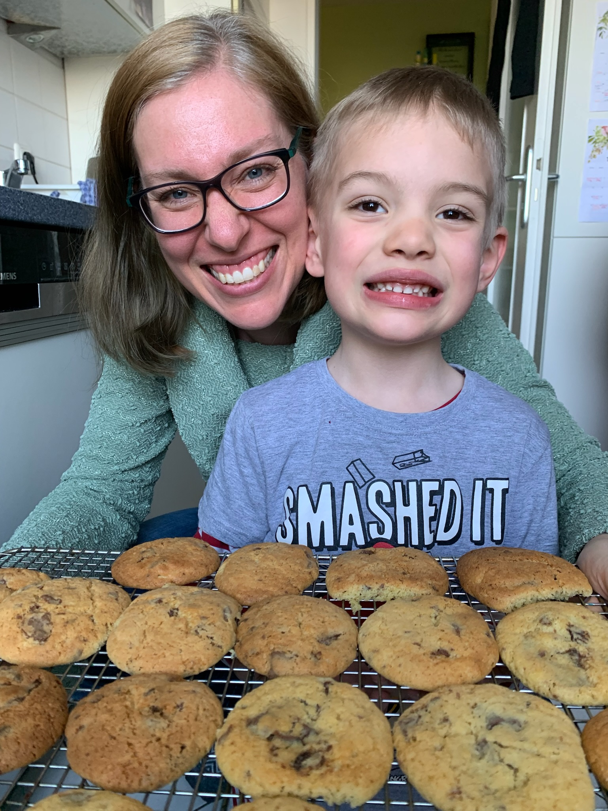

## Digitale Forschung in den religionswissenschaftlichen und theologischen Fächern

### 1. Introduction

Sommersemester 2023  
Prof. Dr. Nathan Gibson

## Tagesordnung

| 14:15-14:55 | Einführende Diskussion | 
| 14:55-15:00 | Kleine Pause | 
| 15:00-15:45 | Lehrplan usw. | 
| 15:45-16:15 | Große Pause | 
| 16:15-16:55 | Datenquellen I | 
| 16:55-17:00 | Kleine Pause | 
| 17:00-17:45 | Datenquellen II | 

## Vorstellungen

### Wer bin ich?

## Wer sind Sie?

Name:  
Studiengang/Jahr:  
Wofür hier:  
Nichtwissenschaftliche Interessen:  

## Nur für sich

Ihre Ziele: 

- inhaltlich: z.B. etwas fremd, mit dem Sie sich bekannt machen wollen
{: .fragment}
- wissenschaftliche Kompetenzen: z.B. beim Lesen, Schreiben, Literaturrecherche, Zeitmanagement
{: .fragment}
- sozial: z.B. Führungspotenzial weiterentwickeln, effektivere Zusammenarbeit
{: .fragment}
- seelisch: z.B. mutig mit harten Fragen umgehen
{: .fragment}

## Diskussionsrunde

1. Was haben Sie in Ihrem Studium soweit _digital_ gemacht?
2. Was könnten Sie sich vorstellen, in Ihrem zukunftigen Arbeit _digital_ zu machen?

## Kleine Pause 

## Lehrplan: Zeitplan 

Freitag	14.04	14–18 c.t (Zoom)  
Freitag	12.05	14–18 c.t  
Samstag	13.05	10–14 c.t.   
Freitag	09.06	14–18 c.t   
Samstag	10.06	10–14 c.t.   
**Freitag	07.07	14–18 c.t. (Zoom)**  

## Schokoladenherstellungsmodell

| {: height="300px" .fragment} | {: height="300px" .fragment} | {: height="300px" .fragment} | {: height="300px" .fragment} |
| **Pick** | **Prepare** | **Process** | **Package** |
| Pflücken | Präparieren | Verarbeiten | Verpacken |
| Datenstruktur | Analyse | Outputs | Datenstruktur |
| Handschriften, Quellen, Interviews | Transkription, Kollation | Textvergleich, Kritik, Auswertung | Edition, Erzählung, Thematisierung |

## Lehrplan: Zeitplan

| 1 |	14.04 | Introduction	|	1. Goals & Rationale
| 2 |	14.04 | Picking Data	|	2. Sources & Biases
| 3 |	12.05 | Preparing Data	|	3. Storing & Versioning
| 4 |	12.05 | 	|	4. Cleaning & Structuring
| 5 |	13.05 | 	|	5. Enriching
| 6 |	13.05 | Processing Data	|	6. Text & Image Analysis

## Lehrplan: Zeitplan

| 7 |	09.06 | Processing Data	|	7. Quantitative & Network Analysis
| 8 |	09.06 | 	|	8. Analysis Critique
| 9 |	10.06 | Packaging Results	|	9. Publishing to a Website
| 10 |	10.06 | 	|	10. Interactive Visualizations
| 11 |	07.07 | Conclusion	|	11. Gallery & Reflections

## Lehrplan: Wichtige Links

(meistens mit **23digitale**)

- Website: [https://**23digitale**.pages.gwdg.de/](https://23digitale.pages.gwdg.de/)  
- OLAT: [https://olat-ce.server.uni-frankfurt.de/olat/auth/RepositoryEntry/18072600580](https://olat-ce.server.uni-frankfurt.de/olat/auth/RepositoryEntry/18072600580)  
- Zotero: [https://zotero.org/groups/**23digitale**/library](https://zotero.org/groups/23digitale/library)
- Etherpad: [https://etherpad.studiumdigitale.uni-frankfurt.de/p/**23digitale**1](https://etherpad.studiumdigitale.uni-frankfurt.de/p/23digitale1) (_am Ende 2, 3 usw. für jede Sitzung_)
- Chat: [https://chat.studiumdigitale.uni-frankfurt.de/channel/23digitale](https://chat.studiumdigitale.uni-frankfurt.de/channel/23digitale) 

## Lehrplan: Sprechstunden

Büro: IG-Farben-Haus 6.552  

- Mittwoch 10–11 Uhr (ohne Termin)
- Mittwoch 11–12 Uhr (mit Termin, Terminbuchung auf [npgibson.com/m/sprechstunden](http://npgibson.com/m/sprechstunden))
- Freitag 13–14 Uhr (per **Zoom** mit Termin, Terminbuchung auf [npgibson.com/m/sprechstunden-zoom](http://npgibson.com/m/sprechstunden-zoom))

## Cookies!

{: style="height: 500px"}

## Lehrplan: Hintergrund & Zielsetzung

_Forschungsfragen anhand digitaler Daten und Werkzeuge kritisch untersuchen zu können._

## Lehrplan: Erwartungen

**Keine Programmierungsvorkenntnissen!**

- Anwesenheit
- wenige Lektüren
- kleines digitale Projekt
- 3 Minireferate (3-Min.) über das Projekt 
- Diskussionen
- respektvoller Umgang

### Was sind Ihre Erwartungen?
{: .fragment}

[https://etherpad.studiumdigitale.uni-frankfurt.de/p/23digitale1](https://etherpad.studiumdigitale.uni-frankfurt.de/p/23digitale1)
{: .fragment}

## Lehrplan: Prüfungsleistungen und Prüfungsform

- Abfrage

## Lehrplan: Zeitplan und Lektüren

S. [https://23digitale.pages.gwdg.de/](https://23digitale.pages.gwdg.de/)  

- meistens verlinkt über die UB mit HRZ-Login
- Alle Literature auf [https://www.zotero.org/groups/23digitale/library](https://www.zotero.org/groups/23digitale/library)

## Lehrplan: Inklusion, Barrierefreiheit und Unterstützung

- Vielseitige Beratungsangebote: [https://www.uni-frankfurt.de/91919538/Beratung__\_Unterst%C3%BCtzung](https://www.uni-frankfurt.de/91919538/Beratung___Unterst%C3%BCtzung)
- Barrierefreiheit beim Studium: [https://www.uni-frankfurt.de/83577918/Wege_zu_Studium_und_Beruf_ohne_Barrieren__\_Willkommen](https://www.uni-frankfurt.de/83577918/Wege_zu_Studium_und_Beruf_ohne_Barrieren___Willkommen)
- Psychotherapeutische Beratung: [https://www.uni-frankfurt.de/120593878/Angebote_der_PBS](https://www.uni-frankfurt.de/120593878/Angebote_der_PBS)

## Lehrplan: Hausarbeiten

- Beratungstermin bei mir buchen
- **Keine Plagiate!**
- Schreibkompetenz mithilfe des Schreibzentrums ausrüsten: [https://www.starkerstart.uni-frankfurt.de/82728115/Schreibberatung](https://www.starkerstart.uni-frankfurt.de/82728115/Schreibberatung)

## Sprache

