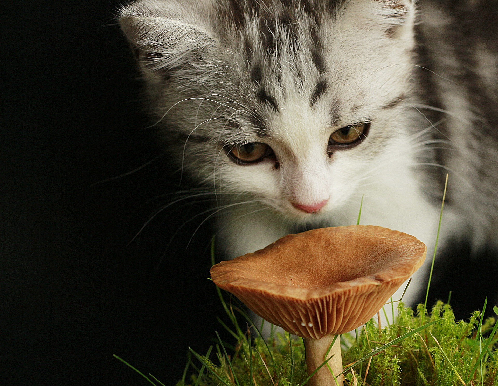

## Digitale Forschung in den religionswissenschaftlichen und theologischen Fächern

### 11. Gallery & Reflections

Sommersemester 2023  
Prof. Dr. Nathan Gibson

## Scheine

- Mittwoch 10:00-11:00 vorbei bringen oder
- mit Frau Kramberger (IG 1.551) lassen

## Review

- Lernziele:
  - Practice cleaning and formatting data using a variety of tools. (Fortsetzung)
  - Explore some ways to enrich your data with markup.
  - Practice applying a research question to text and visual data using off-the-shelf tools.
  - ~~Practice applying a research question to quantitative and network data.~~ (nicht gemacht)

## Review

- Was kann bei der Datenverarbeitung bzw. -formatierung problematisch sein? Was sind mögliche Lösungen dafür?
  - Tabellen
  - Textdateien
  - Bilddateien

## Review

- Was sind **Metadaten**? Was für Details beinhalten sie typischerweise? 
- Was sind mögliche Ansätze für die **Analyse** von 
  - Texten?
  - Bildern?

## Review

- Was sind Darstellungs- bzw. Visualisierungsmöglichkeiten für die 
  - Textanalyse? 
  - Bildanalyse?
  - geographische Analyse?

## Review

- **Websites:** Welche Möglichkeiten haben Sie, wenn Sie Ihr Forschungsprojekt auf eine Website publizieren wollen? Welche Nachhaltigkeitsfragen sind dabei zu beachten?

| Plattform | Einfach? | Nachhaltig? | Anpassbar? |
| -- | -- | -- | -- |
| Analyse- bzw. Visualisierungsplattform verwenden (z.B. Google Sheets, Voyant Tools, Recogito) | ★★★   (nichts zu installieren) | ★  (Zukunft der Plattform nicht garantiert) | ★ |
| Standard Content Management System (CMS, z.B. WordPress) auf Uni- bzw. auf eigenem Server | ★★  (vorinstalliert, muss noch konfiguriert werden) |  ★★ (Standardsoftware wird leichter und auf länger aktualisiert) | ★★  (relativ anpassbar) |

## Review

| Plattform | Einfach? | Nachhaltig? | Anpassbar? |
| -- | -- | -- | -- |
| HTML-Seiten auf Uni- bzw. auf eigenem Server | ★★  (wenig zu installieren) | ★★★ (wartungsfreundlich, wenig Aktualisierungen notwendig) | ★★  (individuell anpassbar aber keine dynamische Datenbank-Funktionen) |
| Individuelle Software auf Uni- bzw. auf eigenem Server | ★  (Installation durch Expert:Innen) | ★  (Wartungsarbeiten bzw. Aktualisierungen und deswegen teuer) | ★★★  (alles ist möglich) |
    
## Lernziel

- Reflect on the practical skills and critical inquiry you learned during the course.

## Referate

1. Wie antwortet Ihre Analyse auf die Forschungsfrage? 
2. Welche Hindernisse mussten Sie dabei umgehen?
3. Warum haben Sie sich für diese Darstellungsform entschieden? 
4. Welche Lücken oder Anomalien sollen dabei beachtet werden?

## Rückblick

- Inwieweit haben Sie Ihre Ziele erreicht?
- Was können Sie jetzt machen, was Sie am Anfang vielleicht selber nicht vorgestellt hätten?
- Vorschläge zum Kursformat?

## Wie geht es weiter?

### Selbstlern Möglichkeiten

- [Programming Historian tutorials](https://programminghistorian.org/en/lessons/)
- [Codecademy](https://www.codecademy.com/) oder ähnliche Angebote für verschiedene Programmierungssprachen

## Wie geht es weiter?

### Summer Schools:
- [DHSI](https://dhsi.org/) in Victoria, Kanada (riesiger Themenauswahl)
- [European Summer University](https://esu.fdhl.info/)
- [EADH Liste von Summer Schools](https://eadh.org/education/digital-humanities-camps-summer-schools)

## Wie geht es weiter?

### An der Goethe Uni
- Kurse von Prof. Dr. Alexander Mehler (Institut für Informatik), z.B. Python

## Wie geht es weiter? 

 Image by <a href="https://pixabay.com/users/holgersfotografie-47038/?utm_source=link-attribution&utm_medium=referral&utm_campaign=image&utm_content=529290">Holger Langmaier</a> from <a href="https://pixabay.com//?utm_source=link-attribution&utm_medium=referral&utm_campaign=image&utm_content=529290">Pixabay</a>
{: .fragment style="width: 800px; float:left; padding: 50px; font-size:x-small"} 

 Image by <a href="https://pixabay.com/users/suju-foto-165106/?utm_source=link-attribution&utm_medium=referral&utm_campaign=image&utm_content=3649048">Susanne Jutzeler, Schweiz 🇨🇭 💕Thanks for Likes</a> from <a href="https://pixabay.com//?utm_source=link-attribution&utm_medium=referral&utm_campaign=image&utm_content=3649048">Pixabay</a>
{: .fragment style="width: 800px; float:left; padding: 50px; font-size:x-small"} 