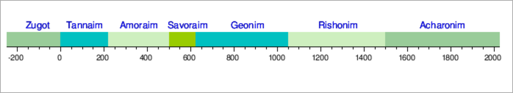
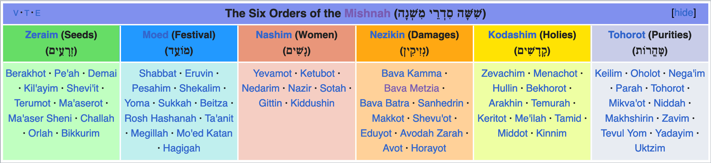

# Entangled Stories 

### The History of Jewish-Christian-Muslim Relations in the Premodern Near East

### 8. Rabbis

Winter Semester 2023  
Prof. Dr. Nathan Gibson

## Review: Martyrs/East & West

- Previous Objectives
  1. Describe what martyrs contributed to the ideology of late antique religion.
  2. Give some examples of political, cultural, and religious differences between eastern and western Christian and Jewish communities.
- Nature of the Roman "persecutions" pre-313 CE (who and what)

## Review: Martyrs/East & West

- Meaning and ideology of "martyr"
- Power of martyrs: civil disobedience, transcending social structures

## Review: Martyrs/East & West

- Monasticism (anchoritic & cenobitic)
- Christianity in the Roman vs. Persian empires: differences in doctrine, politics, language & culture

## Outline: Who were the rabbis?

- The protagonists of rabbinic literature _and_
- Political leaders?
- Religious leaders?

<!-- - Politics
  - 2 Revolts
  - Exclusion
  - Quasi-Autonomy
  - Suppression
- Mishnah and Talmud
- Synagogues
  - hellenism & paganism
- Rabbinic authority
  - Why? 
  - Spiritual or political leaders?
  - Real institutions (so Alon) or imaginary?
- Overall formation of structures capable of preserving community, language, culture -->

## The Protagonists of Rabbinic Literature

> Mishnah Pirkei Avot 1:1-3a (trans. Kulp, <https://www.sefaria.org/Pirkei_Avot.1.2>): **Moses** received the Torah at Sinai and transmitted it to **Joshua**, Joshua to the **elders**, and the elders to the **prophets**, and the prophets to the **Men of the Great Assembly**. They said three things: Be patient in [the administration of] justice, raise many disciples and make a fence round the Torah.  
> **Shimon the Righteous** was one of the last of the men of the great assembly. He used to say: the world stands upon three things: the Torah, the Temple service, and the practice of acts of piety.  
> **Antigonus a man of Socho** received [the oral tradition] from Shimon the Righteous.
{: .r-fit-text .emphasis}    

## The Protagonists of Rabbinic Literature

> Avot d'Rabbi Natan A4:5 (trans. Kasher, <https://www.sefaria.org/Avot_D'Rabbi_Natan.4.5>): ... They came to Vespasian, and they opened the coffin, and [Rabbi Yohanan] got up and stood before him. He said: So you are Rabbi Yohanan ben Zakkai. Ask for whatever you wish, and I will give it to you. He replied: I ask nothing from you except for Yavneh. I will go there and teach my students, and I will establish prayer, and I will do all the mitzvot [mentioned in the Torah].
{: .r-fit-text}

## Rabbinic Literature

<figcaption>
Source: https://en.wikipedia.org/wiki/Tannaim, CC BY SA 3.0.
</figcaption>

## Rabbinic Literature



## Rabbinic Literature

– Diskussionen/Debatten in Studienkreisen

## Rabbinic Literature



## Rabbinic Literature



## Rabbinic Literature

<figcaption>
Source: https://en.wikipedia.org/wiki/Talmud, CC BY SA 3.0.
</figcaption>

## Political Leaders? 

- Revolts
- Legal toleration & citizenship
- Judges, the Sanhedrin, the Patriarchate
- After Theodosios II (5th cent.): legal oppression & marginalization
- Short revival under Persian takeover of Jerusalem

## Political Leaders? 

What was the role of the rabbis in all of this?

## Religious Leaders?

## Synagogues

<https://recogito.pelagios.org/document/ampyw8ma9izk5j/map>

## Synagogues: Bet Alpha



## Synagogues: Bet Alpha



## Synagogues: Sepphoris



## Synagogues: Sepphoris



## Highlights of Jewish-Christian Relations before the Rise of Islam

- Christianity did not grow out of _Rabbinic_ Judaism (the form well-known today), but rather out of Second-Temple Judaism and its basis in earlier Israelite religion as expressed in the Tanakh. 

## Highlights of Jewish-Christian Relations before the Rise of Islam

- Shared but with differing understandings: Monotheism, Prophecy, Tanakh, Messiah, Covenant
- Points of Differentiation: Jesus, New Covenant/Testament, Commandments, Structures
- Sharing & Differentiation (i.e., entanglement) were discussed, debated, and reiterated over several centuries

## Highlights of Jewish-Christian Relations before the Rise of Islam

- Shared experiences 
  - as monotheistic minorities in Greco-Roman ("pagan") and Persian culture
  - through east/west difference
- Role reversal: Christianity as illegal, sometimes persecuted to tolerated and powerful; Judaism as legal and tolerated to oppressed and persecuted

## Important Themes for the Rise of Islam

- Monotheism
- Revelation through prophecy and scripture
- Exegesis (interpretation of scripture) through oral and written means
- Correct belief (orthodoxy) and correct practice (orthopraxy)

## Feedback

<https://ars.particify.de/p/51505325/series/feedback/1>

<iframe data-src="https://ars.particify.de/p/51505325/series/feedback/1" class="r-stretch"></iframe>

## Preview

A New Prophet