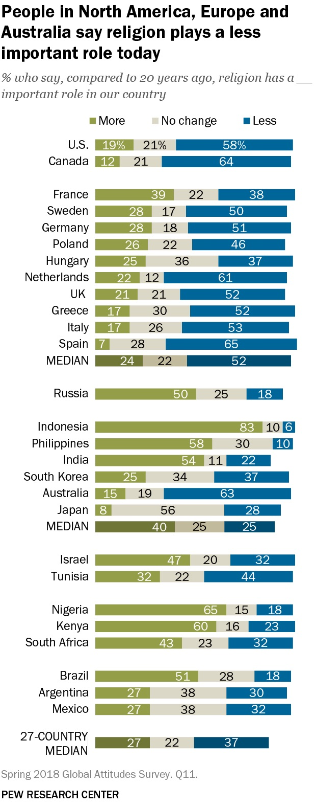
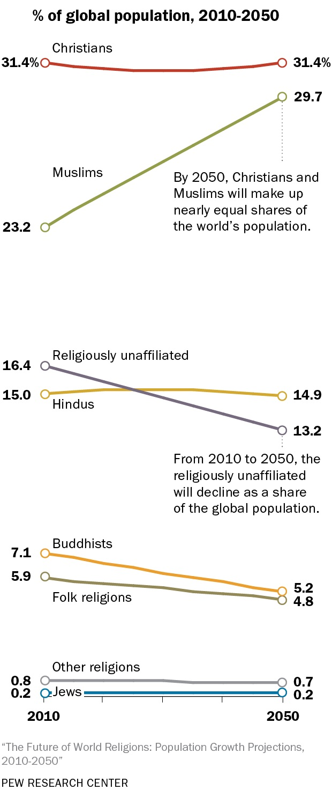
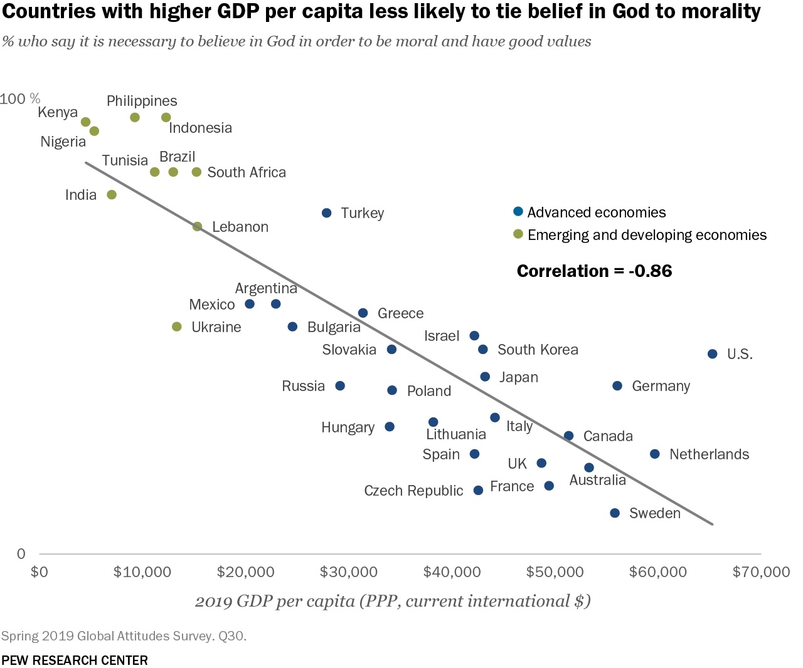
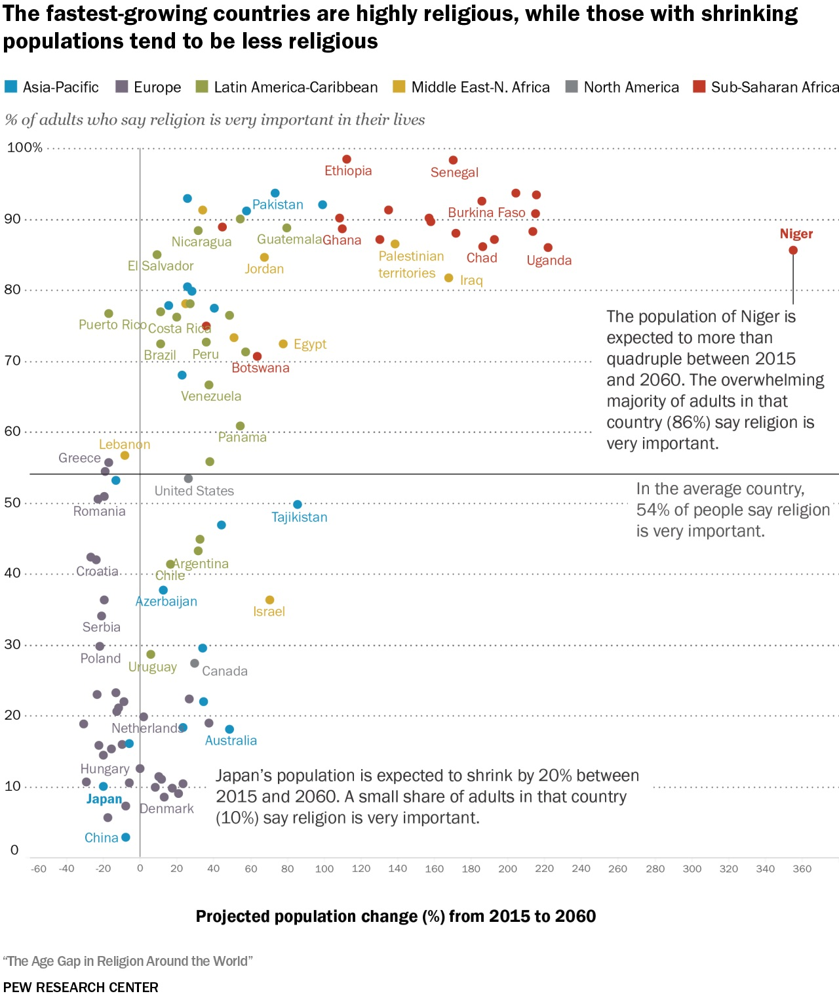
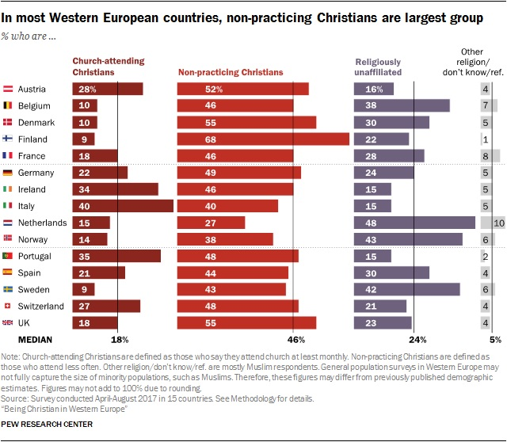
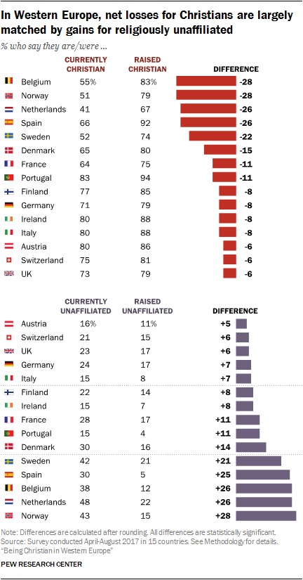
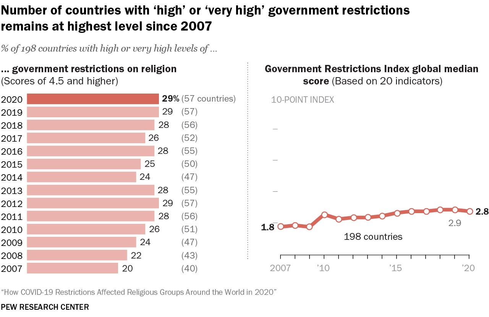

# Interkulturelle Kommunikationswege   

### in sich wandelnden religiösen Umfeldern

### 1. Vorstellungen

Winter Semester 2023  
Prof. Dr. Nathan Gibson

## Wer bin ich?

Prof. Dr. Nathan Gibson  
ngibson@em.uni-frankfurt.de

## Wer sind Sie?

Kurze Runde: 

- Name
- Studiengang
- Lieblings- (Freizeitaktivität, Getränk, Jahreszeit o.ä.)

## Warum sind wir hier?

- Religionen sind immer am Wandeln.
- Menschen sind immer am Wandeln.

## Pew Research Center

- Pew Research Center. 2022. “Key Findings From the Global Religious Futures Project.” Pew Research Center’s Religion & Public Life Project. <https://www.pewresearch.org/religion/2022/12/21/key-findings-from-the-global-religious-futures-project/>.
- Pew Research Center. 2018. “Being Christian in Western Europe.” Pew Research Center’s Religion & Public Life Project. <https://www.pewresearch.org/religion/2018/05/29/being-christian-in-western-europe/>.

## Pew Research Center

{: .r-stretch}

<figcaption>Pew Research Center. 2022. “Key Findings From the Global Religious Futures Project.” Pew Research Center’s Religion & Public Life Project. https://www.pewresearch.org/religion/2022/12/21/key-findings-from-the-global-religious-futures-project/.
</figcaption>

## Pew Research Center

{: .r-stretch}

<figcaption>Pew Research Center. 2022. “Key Findings From the Global Religious Futures Project.” Pew Research Center’s Religion & Public Life Project. https://www.pewresearch.org/religion/2022/12/21/key-findings-from-the-global-religious-futures-project/.
</figcaption>

## Pew Research Center

{: .r-stretch}

<figcaption>Pew Research Center. 2022. “Key Findings From the Global Religious Futures Project.” Pew Research Center’s Religion & Public Life Project. https://www.pewresearch.org/religion/2022/12/21/key-findings-from-the-global-religious-futures-project/.
</figcaption>

## Pew Research Center

{: .r-stretch}

<figcaption>Pew Research Center. 2022. “Key Findings From the Global Religious Futures Project.” Pew Research Center’s Religion & Public Life Project. https://www.pewresearch.org/religion/2022/12/21/key-findings-from-the-global-religious-futures-project/.
</figcaption>

## Pew Research Center

{: .r-stretch}

<figcaption>Pew Research Center. 2018. “Being Christian in Western Europe.” Pew Research Center’s Religion & Public Life Project. https://www.pewresearch.org/religion/2018/05/29/being-christian-in-western-europe/.
</figcaption>

## Pew Research Center

{: .r-stretch}

<figcaption>Pew Research Center. 2018. “Being Christian in Western Europe.” Pew Research Center’s Religion & Public Life Project. https://www.pewresearch.org/religion/2018/05/29/being-christian-in-western-europe/.
</figcaption>

## Pew Research Center

{: .r-stretch}

<figcaption>Pew Research Center. 2022. “Key Findings From the Global Religious Futures Project.” Pew Research Center’s Religion & Public Life Project. https://www.pewresearch.org/religion/2022/12/21/key-findings-from-the-global-religious-futures-project/.
</figcaption>

## Warum sind wir hier?

- Religionen sind immer am Wandeln.
- Menschen sind immer am Wandeln.
- Religiöser Wandel steht immer im Hintergrund (oder Vordergrund) der interkulturellen Kommunikation.
  - Beispiele ... 

## Ihr Ziel in diesem Seminar 



## Heutiges Lernziel

<i class="fa-solid fa-check"></i> Ihre Rolle in diesem Seminar vorzustellen.

## Was verbindet uns? 

3 Wörter, mit denen Sie Ihre 

- religiöse bzw. kulturelle Zugehörigkeit und
- eine Leidenschaft

beschreiben würden.

## Lehrplan

## Sprechstunden

Office: IG-Farben-Haus 6.552  
Sprechstunden:  
- Montag 14:00-15:00 (ohne Termin)
- Montag 15:00-16:00 (mit Termin, Terminbuchung auf <https://npgibson.com/m/sprechstunden>)
- Freitag 13:000-14:00 (per Zoom mit Termin, Terminbuchung auf <https://npgibson.com/m/sprechstunden-zoom>)

## Lehrplan: Links

- **Kurswebsite**: <https://24inter.pages.gwdg.de>  

## Lehrplan: Links

- <https://24inter.pages.gwdg.de>  
- Im Unterricht
  - **Etherpad** für kollaborative Arbeit: [/pad](/pad)
  - **Particify** für Umfragen: [/poll](/poll)

## Lehrplan: Links
- <https://24inter.pages.gwdg.de>  
- Optional
  - **Zotero** Bibliographie: [/zotero](/zotero)
  - **RocketChat**: [/chat](/chat)

## Ihre Erwartungen?

## Vorschau

Interkulturelle Kommunikation: ein Ritual mitbringen

## Empfehlungen

- Ringvorlesung "Nachbarschaften" montags
- Exkursion Innsbruck (Sehnsucht Seminar mit Prof. Dr. Valentin)