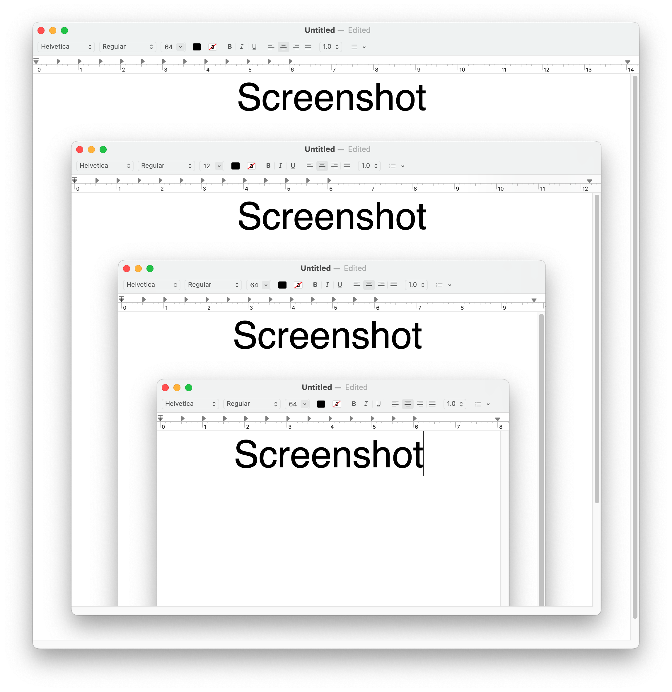
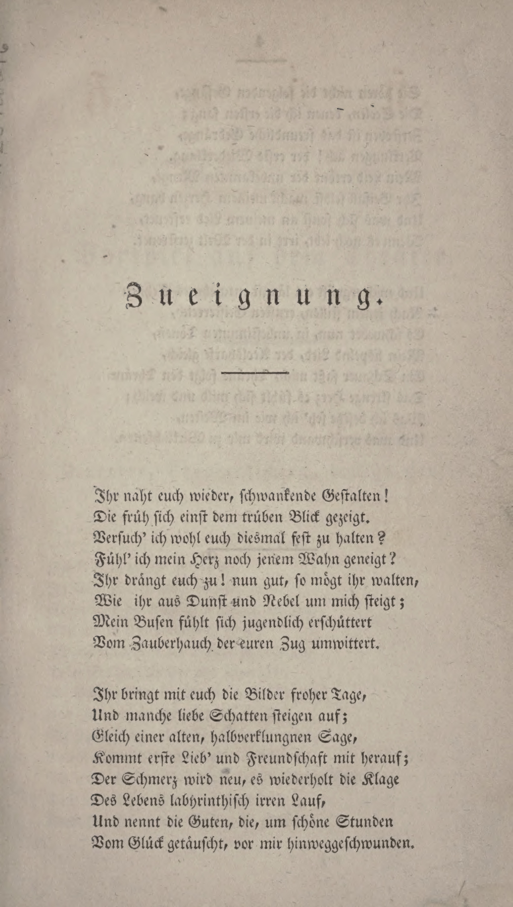
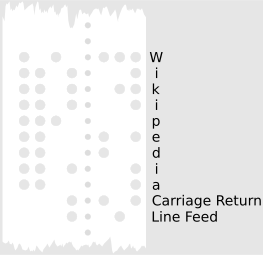

# Working with Digital Data

### in Religious Studies

### 2. Working with Text: Get the Most out of "Plain" Text and Regular Expressions

Winter Semester 2023  
Prof. Dr. Nathan Gibson

## 📈 Review

Last objective: Consider your personal goals for the semester within the big picture of digital data in religious studies.

## 📈 Review: Chocolate Model

| {: height="300px" .fragment} | {: height="300px" .fragment} | {: height="300px" .fragment} | {: height="300px" .fragment} |
| **Pick** | **Prepare** | **Process** | **Package** |
| Inputs/Sources | Structuring data | Analysis | Outputs/Presentation |
| Manuscripts, Photos, Interviews | Transcribing, Collating | Textual comparison, criticism, content analysis, coding | Edition, Narrative, Thematic discussion, Interactive website |

## 📈 Review: Group Work on Sources

<https://etherpad.studiumdigitale.uni-frankfurt.de/p/24data2>

## 📈 Review: Optional Assignment

A question for a ChatAI?

## 🧭 Today's Learning Objective

Understand plain text as a foundational type of data.

## Which of these is text from the computer's perspective?

a. Text
{: style="font-size: larger"}

b. Very fancy
{: style="font-family: 'rothenburg_decorativenormal'; font-size: larger"}

c. Backwards
{: style="transform: rotateY(180deg); font-size: larger"}

d. Emojis 🦉👀🐁❤️🐛
{: style="font-size: larger"}

e. Invisible character‎
{: style="font-size: larger"}

f. Math equation 𝓐 = 4𝛑𝑟²
{: style="font-size: larger"}

## Which of these is text from the computer's perspective? (continued)

g. Arabic عربيّة
{: style="font-size: larger"}

h. Domino game 🁍🀱🀲🀺🁃
{: style="font-size: larger"}

i. Hieroglyphics (version 1)[^1]: 
{: style="font-size: larger"}
{: style="width: 200px; margin: auto"}

j. Hieroglyphics (version 2):  
𐦐𐦗𓂅𓂧𓂋𐦉𓂂𐦇𓂂𓂑𐦓
{: style="font-size: larger"}

k. Screenshot
{: style="font-size: larger"}
{: style="width: 200px; margin: auto"}

l. Page scan
{: style="font-size: larger"}
{: style="width: 200px; margin: auto"}

## Even this is text

⠀⠀⠀⠀⠀⠀⠀⠀⢀⣴⣾⣿⣷⣾⣿⣿⣿⣷⣤⣤⣀⡀⠀⠀⠀⠀⠀⠀⠀⠀
⠀⠀⠀⠀⠀⠀⢀⣤⣿⣿⣷⣢⣌⣭⣍⢻⣿⡟⣽⣿⣿⣿⣦⠀⠀⠀⠀⠀⠀⠀
⠀⠀⠀⠀⠀⠀⣾⣿⠟⣷⡾⠛⠋⠉⠛⠛⠛⢷⣉⣭⣿⣿⣿⡀⠀⠀⠀⠀⠀⠀
⠀⠀⠀⠀⠀⢾⣿⣿⣿⣿⠁⠀⠀⠀⠀⠀⠀⠀⣿⣷⡌⣿⣿⣷⠀⠀⠀⠀⠀⠀
⠀⠀⠀⠀⠀⣸⣿⣿⣿⡟⠀⢀⡀⠀⠀⠀⢀⣀⢹⣿⡿⢿⣿⣿⠀⠀⠀⠀⠀⠀
⠀⠀⠀⠀⠀⣿⣿⣿⣿⡇⣎⢥⣿⣷⡄⣾⣿⣭⢽⣿⡇⣾⣿⣿⡄⠀⠀⠀⠀⠀
⠀⠀⠀⠀⢀⣿⠻⢟⣿⠇⠈⠋⠁⢹⡀⣿⡇⠹⠟⣿⣿⣮⣤⣾⣿⠀⠀⠀⠀⠀
⠀⠀⠀⠀⠈⢿⣷⣿⢿⣠⠀⠀⠀⣤⡄⣻⡧⠀⠀⣿⣿⡟⠿⠿⠃⠀⠀⠀⠀⠀
⠀⠀⠀⠀⠀⠀⢀⣴⣿⣿⡄⠀⠠⣤⢌⠭⣥⢀⣼⣿⣿⣿⣷⣄⠀⠀⠀⠀⠀⠀
⠀⠀⠀⠀⠀⠀⢺⣿⣿⣿⠋⢦⡀⠐⠓⠒⣿⣿⣿⠿⣿⣿⣿⠏⠀⠀⠀⠀⠀⠀
⠀⠀⠀⠀⠀⠀⠀⢹⣿⣿⣆⠈⠻⢶⣶⣾⡿⠟⠁⢀⣿⣿⡟⠀⠀⠀⠀⠀⠀⠀
⠀⠀⠀⢀⣠⣴⣾⣿⣯⢿⣏⢦⡀⠀⣰⢧⡀⠀⣠⡞⣿⣿⣿⣷⣦⣄⡀⠀⠀⠀
⠀⣤⣾⣿⣿⣿⣿⣿⣿⣷⡻⣦⡉⢿⢭⡞⣻⠿⢋⣼⣿⣿⣿⣿⣿⣿⣿⣷⣦⠀
⣼⣿⣿⣿⣿⣿⣿⣿⣿⣿⣿⣿⣿⣿⣷⣿⣿⣷⣿⣿⣿⣿⣿⣿⣿⣿⣿⣿⣿⣧
⠻⠿⠿⠿⠿⠿⠿⠿⠿⠿⠿⠿⠿⠿⠿⠿⠿⠿⠿⠿⠿⠿⠿⠿⠿⠿⠿⠿⠿⠿

## There are 10 types of people in the world ... 

### ... Those who understand binary, and those who don't.
{: .fragment}

{: style="width: 500px" .fragment}

<figcaption>By <a href="https://en.wikipedia.org/wiki/User:Vanessaezekowitz" class="extiw" title="wikipedia:User:Vanessaezekowitz">Vanessaezekowitz</a> at <a href="https://en.wikipedia.org/wiki/" class="extiw" title="wikipedia:">English Wikipedia</a>, <a href="https://creativecommons.org/licenses/by-sa/3.0" title="Creative Commons Attribution-Share Alike 3.0">CC BY-SA 3.0</a>, <a href="https://commons.wikimedia.org/w/index.php?curid=32927184">Link</a></figcaption>

## The importance of text in computing

Text as the most important unit of human-machine interaction

- communication
- programming
- websites

## The importance of text in digital humanities

Many humanistic disciplines such as history, philology, literature, theology, and anthropology primarily use _textual_ sources.

Many humanistic disciplines also do their analysis and communicate their results using primarily text.

## But the world is not text!

- Can and should the thing I want to study be represented as text? 
  - An ancient manuscript?
  - A work of art?
  - A musical work?
  - An interview?
  - Archeological findings?
  - Polling/survey responses?

## "Plain Text"

Text without formatting:

Plain text

_Formatted_ **text**

Even crazier formatted text!
{: style="transform: rotateY(180deg); font-family: 'NewtSerifLight-Italic'; font-size: larger"}

## "Plain Text"

Plain text can be opened in _any_ text program. Microsoft Word, Notepad, TextEdit, even a web browser. <a href="../assets/downloads/plaintext.txt" download>Try it!</a>

You might see ".txt" on the end of a plain text file, but actually the file extension doesn't really matter. <a href="../assets/downloads/plaintext.whateveryoulike" download>Try it!</a>

## "Plain Text"

But plain text still has an "encoding."

Arabic in an old encoding (Windows-1256) <a href="../assets/downloads/arabic-windows1256.txt" download>Try it!</a>

Arabic in Unicode (UTF-8) <a href="../assets/downloads/arabic-utf8.txt" download>Try it!</a>

## 📖 Readings: Unicode

- What is Unicode? 
- What surprised you in the list of Unicode characters?

## Break

## What are Regular Expressions (RegEx)?

A regular expression is a sequence of characters (string of letters) that defines a text pattern. 

Different programs use different standards for those patterns, but many of them work similarly and are called “RegEx.”

For example, to find numbers in a text, you don’t have to search many different times for “0” and then “1”, “2”, etc. You can just search for “\d” which represents all numbers.

## What can you do with RegEx?

Search for patterns of text and replace them with other patterns. For example,

- Change dates from format 12/9/2020 to 09.12.2020.
- Remove extra spaces and blank lines.
- Find words or phrases with many variations (Munich, München, Monaco).
- Find everything in a certain script (all Arabic characters, all Latin characters).
- Standardize your transcriptions.

## What can you do with RegEx?

- Find Arabic/Hebrew words with different vocalizations.
- Find invisible formatting characters like line breaks, tabs, and right-to-left control characters.
- Find types of things that use common patterns, like capitalized words, dates, or names (e.g., using Abū/Umm and bin/bint to find all names with the pattern Abū Fulān Fulān bin Fulān).

## RegEx Tutorial

<https://docs.google.com/spreadsheets/d/1jTmHopCz8Il6tBopZlG2LfgMSEOuvMJh-Q7nzUwLkvE/edit?usp=sharing> (You can experiment by copying the document for yourself or using rows 30+)

See also:

- Thorough explanation of RegEx including advanced topics: <https://www.regular-expressions.info/>
- Place to experiment with RegEx (there are many others you can find online): <https://regexr.com/>

## Visual Studio Code

Download and install <https://code.visualstudio.com/>

## Brainstorming about your projects

<https://etherpad.studiumdigitale.uni-frankfurt.de/p/24data2>

## Preview

Git Versioning

## Endnotes

[^1]: Lundström, Peter. (2020). PHARAOH.SE Available at: <https://pharaoh.se/ancient-egypt/pharaoh/cleopatra-vii/> [Accessed 25 Apr. 2024]. CC-BY 4.0.