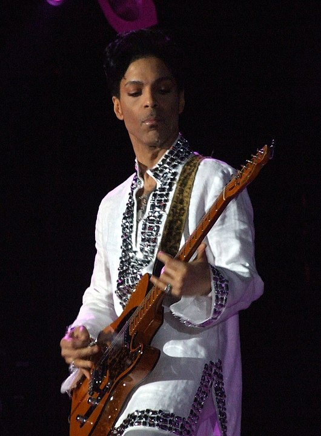
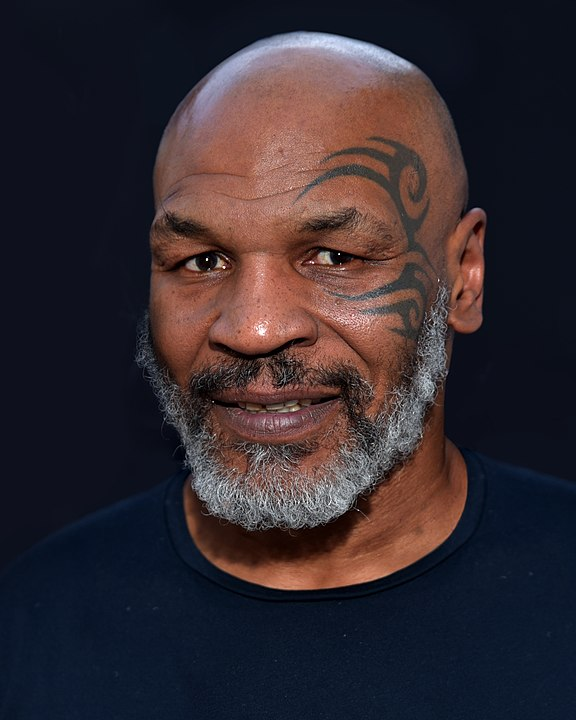
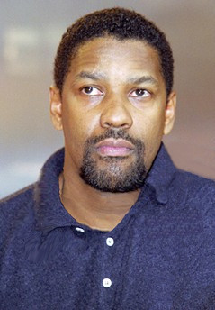

# Interkulturelle Kommunikationswege   

### in sich wandelnden religiösen Umfeldern

### 3. Einführung: Zugehörigkeit

Sommersemester 2024  
Prof. Dr. Nathan Gibson

## 📈 Rückblick

Wie kann interkulturelle Kommunikation fair und einfühlsam praktiziert werden?

Letztes Lernziel: Praktiken der teilnehmenden Beobachtung auf die interkulturelle Kommunikation anwenden können.

- Teilnehmende Beobachtung: was und wofür
- Übung Ritualien
- Übung Israel/Palästina-Diskussion

## Podcast

[Podcast Checklist](/podcast)

## Heutige Frage und Heutiges Lernziel

Was ist religiöse Zugehörigkeit?

🧭 Das Spektrum in den Griff bekommen, was es bedeuten kann, einer Religion zuzugehören.

## Spiel: Wer ist das?

Source: https://edition.cnn.com/2014/01/23/living/gallery/religious-celebs/index.html

## "I'm definitely a practicing Hindu."

- Julia Roberts
{: .fragment}
- Kevin Hart
{: .fragment}
- Anupam Kher
{: .fragment}
- Justin Bieber
{: .fragment}

Julia Roberts
{: .fragment}

{: .fragment style="height: 300px; margin: auto"}

## Doesn't do social media on the Sabbath?

- Joseph Gordon-Levitt
{: .fragment}
- Mayim Bialik
{: .fragment}
- Katharine Hepburn
{: .fragment}
- Miley Cyrus
{: .fragment}

Mayim Bialik (Big Bang Theory)
{: .fragment}

{: .fragment style="height: 300px; margin: auto"}

## Has gone door-to-door to share beliefs as a Jehovah's Witness?

- Prince
{: .fragment}
- Oprah Winfrey
{: .fragment}
- Taylor Swift
{: .fragment}
- Tom Cruise
{: .fragment}

Prince
{: .fragment}

{: .fragment style="height: 300px; margin: auto"}

## "Allah doesn't need me; I need Allah."

- Jennifer Aniston
{: .fragment}
- Queen Latifah
{: .fragment}
- Daniel Radcliffe
{: .fragment}
- Mike Tyson
{: .fragment}

Mike Tyson
{: .fragment}

{: .fragment style="height: 300px; margin: auto"}

## "reads the Bible every day"

- Denzel Washington
{: .fragment}
- Gal Gadot
{: .fragment}
- Idris Elba
{: .fragment}
- Lebron James
{: .fragment}

Denzel Washington
{: .fragment}

{: .fragment style="height: 300px; margin: auto"}

## Taught in a Tibetan monastery and is a "philosophical" Buddhist.

- Chris Pratt
{: .fragment}
- Elon Musk
{: .fragment}
- Steven Spielberg
{: .fragment}
- Benedict Cumberbatch
{: .fragment}

Benedict Cumberbatch
{: .fragment}

{: .fragment style="height: 300px; margin: auto"}

Source: https://www.hollywoodreporter.com/movies/movie-news/benedict-cumberbatch-confessions-fifth-estate-625408/
{: .fragment}

## 📖 Lektüre (Weltecke)

- Welche Begriffe wurden hier diskutiert (Überschriften)? 
{: .fragment}
- Was ist Welteckes Hauptfrage bzw. Ziel? 
{: .fragment}
- Erklärung: "semantische Bandbreite" 
{: .fragment}

## 🔭 vormodern vs. modern

- Peter Berger: We are all heretics now. 
{: .fragment}
- "Religion" rückblickend auf vormoderne? 
{: .fragment}
- dieselben Religionen heute?
{: .fragment}
- "None" =? auch religiöse Entscheidung
{: .fragment}
- nicht-westliche/außereuropäische Kulture? 
{: .fragment}

## 📖 Lektüre (McGuire, _Lived Religion_)

- Wie bezeichnet McGuire das Begriff "Lived Religion"? 
{: .fragment}
- Warum plädiert sie für dieses Begriff?  
{: .fragment}
- Sehen Sie in Ihrem Bekanntenkreis eher Bespiele von Menschen, die solche Mischungen, Hybridities und "lived religion" erleben oder eher Leute die sich an vordefinierte Religionen anhängen?  
{: .fragment}

## Poll

<https://ars.particify.de/p/55069903/series/3-Zugeh%C3%B6rigkeit>

## 🔭 Reflexion

-  Wenn wir den religiösen Wandel von Menschen betrachten, wo überschneidet sich dies mit Glaubensinhalten (Lehre, _doctrina_)?
{: .fragment}
-  Wenn wir die Komplexität von "lived religion" anerkennen, wie können wir unsere Vorstellungen bzw. unsere Gespräche entsprechend anpassen? (Konkret: in dieser Gruppe)
{: .fragment}

## Vorschau

Warum schließen religiöse Gemeinschaften andere Menschen aus?